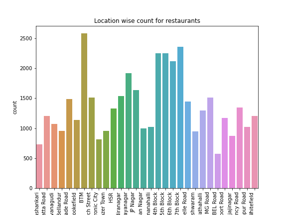
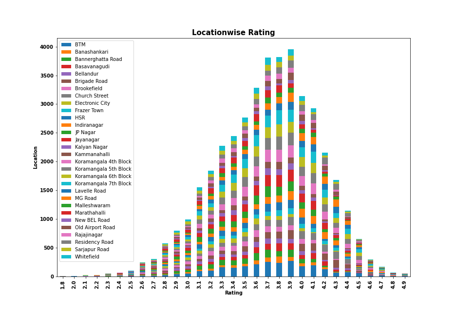
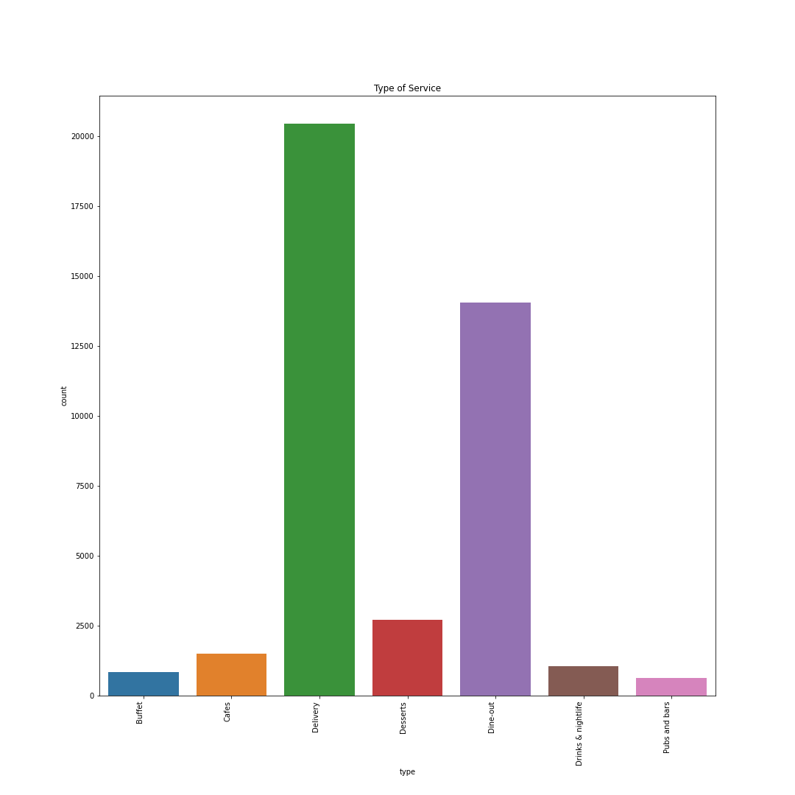
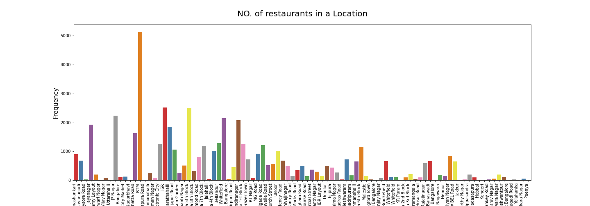
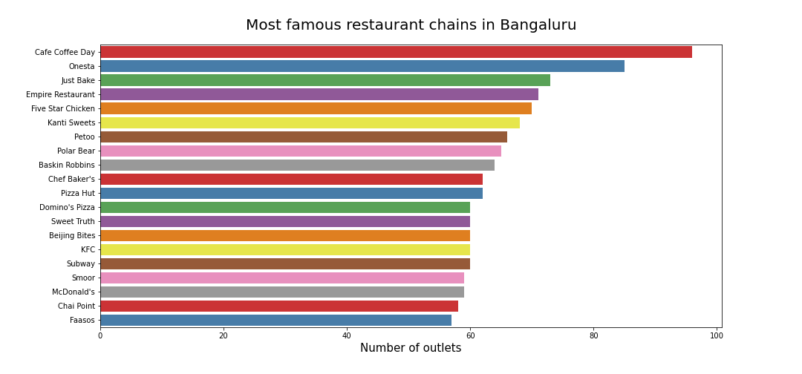
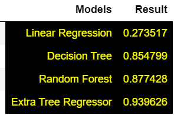

# Zomato Dataset Exploratory Data Analysis 

### Business Case :
#### The basic idea is analyzing the Buisness Problem of Zomato  to get a fair idea about the factors affecting the establishment of different types of restaurant at different places in Bengaluru, aggregate rating of each restaurant and many more.

#### Data Source : https://www.kaggle.com/shrutimehta/zomato-restaurants-data

### Table of Contents:
 1. Loading the dataset: Load the data and .
       <ul>
       <li>Load the data.</li>
       <li>Import the libraries.</li>
      
      </ul>

 2. Data Cleaning:
      <ul>
       <li>Deleting redundant columns.</li>
       <li>Renaming the columns.</li>
       <li>Dropping duplicates</li>
       <li>Cleaning individual columns.</li>
       <li>Remove the NaN values from the dataset.</li>
       <li> #Some Transformations</li>
      </ul>
      

     
 3. Regression Analysis
       <ul>
       <li>Linear Regression</li>
       <li>Decision Tree Regression</li>
       <li>Random Forest Regression</li>
 
      </ul>

      
      
      
 4. Data Visualization: Using plots to find relations between the features.
      <ul>
       <li>Restaurants delivering Online or not</li>
       <li>Table booking Rate vs Rate</li>
       <li> Best Location</li>
       <li>Relation between Location and Rating</li>
       <li>No. of restaurants in a Location.</li>
       <li>Restaurant type</li>
       <li>Most famous restaurant chains in Bengaluru</li>
      </ul>

     
     
     

<pre> <b> Location Wise Count for Resturants    </b></pre> 

                          

<pre> <b> Type of Services offered by restaurants  </b></pre> 

 

<pre> <b> Number of restaurants in a location </b></pre> 

 

<pre> <b> Most Famous restaurant chains in bangalore  </b></pre> 

 

<pre> <b> Comparision of different ML Models  </b></pre> 

 

